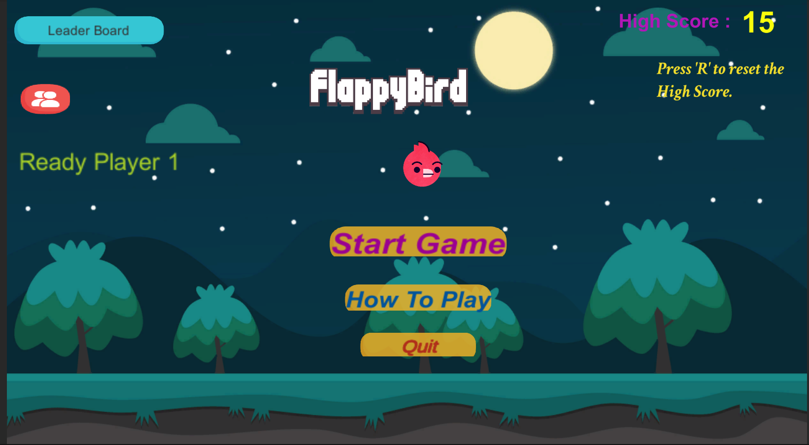
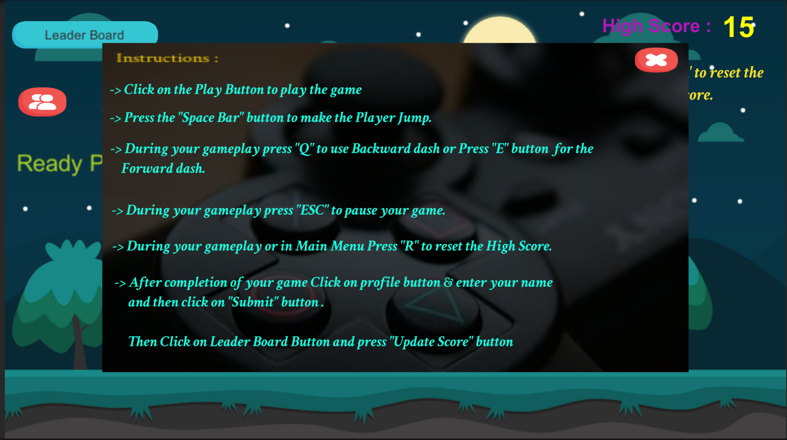
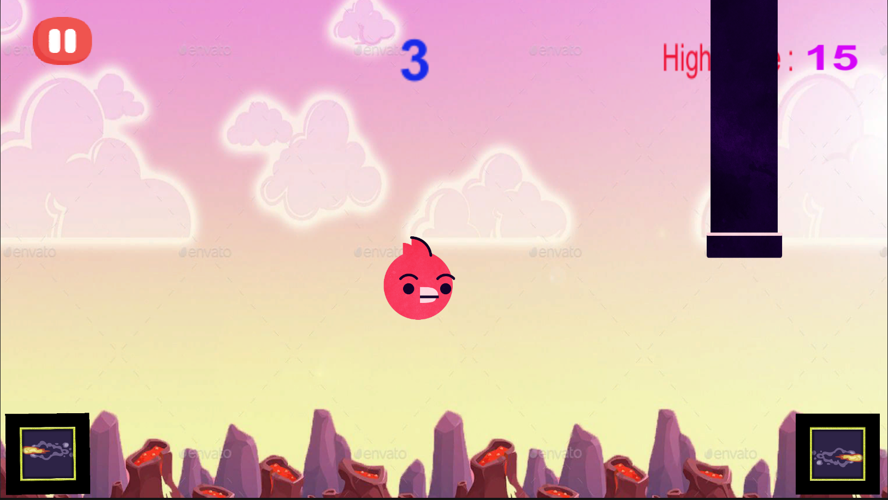

# BirdGame

## Description

This is a 2D Flappy Bird game with added features such as a coin system, highscore tracking, and special powers. Players can collect coins to increase their highscore, and use special powers for a limited duration.

## Features

- **Flappy Bird Gameplay:** Classic Flappy Bird gameplay with simple controls.
- **Coin System:** Collect coins to increase your highscore.
- **Special Powers:** Gain special powers for a limited duration by using collected items.
- **Cooldown Timer:** A 10-second cooldown prevents the player from using the same power consecutively.
- **Online Highscore:** Post your name along with your highscore to compete with others online.

## How to Play

1. Clone the repository to your local machine.
2. Open the project in your preferred game development environment.
3. Run the game and use the specified controls to navigate the bird.
4. Collect coins to increase your highscore.
5. Use special powers strategically to overcome obstacles.
6. After the game, enter your name to post your highscore online.

## Controls

- **Spacebar:** Flap the bird to avoid obstacles.
- **Esc:** Pause the game.
- **Q, E:** Use special powers (each power corresponds to a different key).

## Special Powers

1. **Power A:** Allows the player to dash forward a little.
2. **Power B:** Allows the player to dash backwards a little.

## Cooldown Timer

- After using a special power, a 10-second cooldown period is initiated.

## Online Highscore

- Post your name along with your highscore to https://danqzq.itch.io/leaderboard-creator (Only the game creator can view the player scores).

## Screenshots

## Contributing

Feel free to contribute to the project by opening issues or creating pull requests.

## License

This project is licensed under the [MIT License] - see the [LICENSE.md] file for details.
